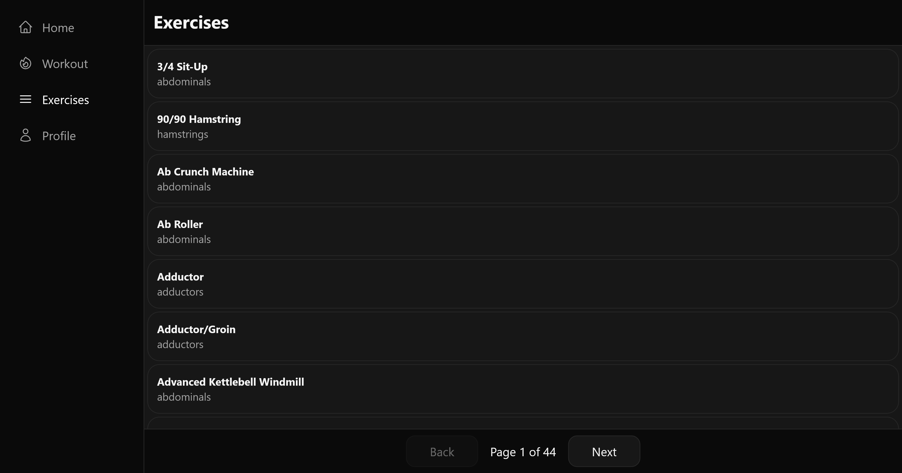

# Workout Tracker (Frontend)

A workout tracking app for logging exercises and following your progress over time.
This is the frontend for [workout-tracker](https://github.com/A-Saikhan/workout-tracker).

> **Status:** Work in progress. Browsing the exercise catalogue (873 exercises)
> works. Workout logging is planned once authentication is in place. See the current [roadmap](https://github.com/A-Saikhan/workout-tracker#roadmap).

## Links and preview

- [Live demo](https://workout.saikhan.dev)
- [Backend repository](https://github.com/A-Saikhan/workout-tracker)



## Tech stack

React with TypeScript, built with Vite. Data fetching through TanStack Query,
routing with React Router, styling with Tailwind.

## Running it locally

> **The backend has to be running.** Without it the exercise list stays empty.
> See the [backend repository](https://github.com/A-Saikhan/workout-tracker) for
> its setup.

Clone the repository and move into the project folder:

```bash
git clone https://github.com/A-Saikhan/workout-tracker-frontend
cd workout-tracker-frontend
```

Install the dependencies:

```bash
npm install
```

Copy the example environment file:

```bash
cp .env.example .env.local
```

Open `.env.local` and point `VITE_API_URL` at your local backend:

```
VITE_API_URL=http://localhost:8080/api
```

Start the dev server:

```bash
npm run dev
```

The app is now available on `localhost:5173`. Open the exercise list to confirm
that it reaches the backend.

## Building for production

```bash
npm run build
```

The output lands in `dist/` and can be served by any static web server.

In production the frontend and the API run on the same domain behind nginx, so a
relative path is enough and no CORS setup is needed:

```
VITE_API_URL=/api
```

Note that Vite inlines `VITE_*` variables at build time, so they end up readable
in the bundle. Never put secrets in them.

## Credits

Exercise data comes from [free-exercise-db](https://github.com/yuhonas/free-exercise-db),
released into the public domain.

## License

Released under the MIT License. See [LICENSE](LICENSE) for details.